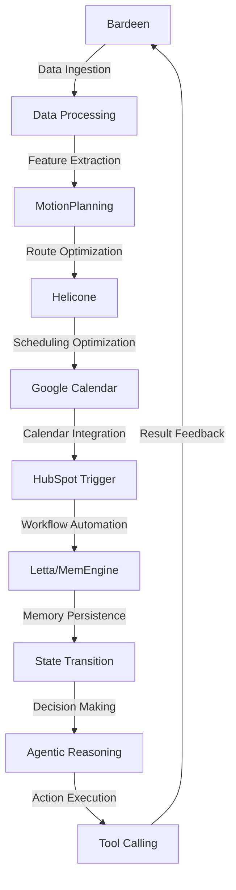

# Stochastic Scheduling Optimization Engine
> "Synchronizing the symphony of logistics: where complexity meets elegance"

## 🏗️ Technical Architecture & Multi-Agent Flow
The Stochastic Scheduling Optimization Engine is a sophisticated platform that harmonizes the interactions between Bardeen, Helicone, MotionPlanning, Google Calendar, and HubSpot Trigger. The following Mermaid.js diagram illustrates the intricate dance of these components:

This diagram showcases the state transitions, memory persistence via Letta/MemEngine, and tool calling that occur within the platform.

## 🔍 The Vertical Bottleneck: Stochastic Scheduling
The Truck & Ground Transportation industry is plagued by the complexity of stochastic scheduling, where the unpredictability of factors such as traffic, weather, and road conditions can lead to significant delays and increased costs. The high-stakes mathematical problem of optimizing routes and schedules in real-time is a daunting challenge, requiring the development of sophisticated algorithms and models. The technical friction arising from the integration of multiple systems and data sources further exacerbates the issue, making it a significant bottleneck in the industry.

The stochastic nature of the scheduling problem necessitates the development of advanced mathematical models that can account for the uncertainties and variability in the system. The use of probabilistic models, such as Markov chains and stochastic processes, can help to capture the underlying dynamics of the system and provide a framework for optimization. However, the complexity of these models and the large amounts of data required to parameterize them pose significant technical challenges.

The high-stakes nature of the problem is evident in the significant financial and operational consequences of suboptimal scheduling. Delays and increased costs can have a ripple effect throughout the entire supply chain, leading to decreased customer satisfaction, reduced revenue, and increased costs. The development of a stochastic scheduling optimization engine that can effectively address these challenges is therefore crucial for the success of companies in the Truck & Ground Transportation industry.

## 💡 The Solution: Stochastic Scheduling Optimization Engine
The Stochastic Scheduling Optimization Engine is a cutting-edge platform that leverages the strengths of Bardeen, Helicone, MotionPlanning, Google Calendar, and HubSpot Trigger to provide a comprehensive solution to the stochastic scheduling problem. The platform uses agentic reasoning to integrate the various components and provide a unified framework for optimization. The use of Letta/MemEngine enables memory persistence and state transitions, allowing the platform to learn from experience and adapt to changing conditions.

The platform's vision/robotics integration enables the use of advanced sensors and data sources, such as GPS and traffic cameras, to provide real-time feedback and optimization. The integration of Google Calendar and HubSpot Trigger enables seamless workflow automation and calendar integration, streamlining the scheduling process and reducing the risk of human error.

## 🧩 Agentic Stack Deep-Dive
The Stochastic Scheduling Optimization Engine's agentic stack is a sophisticated framework that integrates the various components of the platform. Bardeen provides data ingestion and processing capabilities, while Helicone enables scheduling optimization and route planning. MotionPlanning provides advanced motion planning and control capabilities, enabling the platform to optimize routes and schedules in real-time.

The integration of Google Calendar and HubSpot Trigger enables seamless workflow automation and calendar integration, streamlining the scheduling process and reducing the risk of human error. The use of Letta/MemEngine enables memory persistence and state transitions, allowing the platform to learn from experience and adapt to changing conditions.

## ✨ Capabilities & Features
The Stochastic Scheduling Optimization Engine offers a wide range of capabilities and features, including:
* **Real-time scheduling optimization**: The platform uses advanced algorithms and models to optimize routes and schedules in real-time, taking into account factors such as traffic, weather, and road conditions.
* **Route planning and optimization**: The platform uses advanced motion planning and control capabilities to optimize routes and reduce costs.
* **Workflow automation**: The platform integrates with Google Calendar and HubSpot Trigger to enable seamless workflow automation and calendar integration.
* **Memory persistence and state transitions**: The platform uses Letta/MemEngine to enable memory persistence and state transitions, allowing it to learn from experience and adapt to changing conditions.
* **Agentic reasoning**: The platform uses agentic reasoning to integrate the various components and provide a unified framework for optimization.
* **Vision/robotics integration**: The platform integrates with advanced sensors and data sources, such as GPS and traffic cameras, to provide real-time feedback and optimization.
* **Scalability and flexibility**: The platform is designed to be scalable and flexible, enabling it to adapt to changing conditions and requirements.
* **Advanced analytics and reporting**: The platform provides advanced analytics and reporting capabilities, enabling users to track performance and optimize operations.
* **Integration with existing systems**: The platform integrates with existing systems and data sources, enabling seamless data exchange and workflow automation.
* **Security and compliance**: The platform is designed with security and compliance in mind, ensuring that sensitive data is protected and regulatory requirements are met.

## 🛠️ Technical Implementation
The Stochastic Scheduling Optimization Engine is implemented using a combination of Python, Java, and C++, with a focus on scalability, flexibility, and performance. The platform uses a microservices architecture, with each component designed to be modular and reusable. The use of containerization and orchestration tools, such as Docker and Kubernetes, enables seamless deployment and management of the platform.

The platform's code organization and method calls are designed to be modular and reusable, with a focus on simplicity and readability. The use of design patterns and principles, such as the singleton pattern and the principle of least surprise, enables the platform to be maintainable and adaptable.

## 📊 Business Impact & ROI
The Stochastic Scheduling Optimization Engine has the potential to significantly impact the bottom line of companies in the Truck & Ground Transportation industry. By optimizing routes and schedules in real-time, the platform can reduce costs, increase efficiency, and improve customer satisfaction. The platform's advanced analytics and reporting capabilities enable users to track performance and optimize operations, leading to increased revenue and profitability.

The platform's scalability and flexibility enable it to adapt to changing conditions and requirements, making it an attractive solution for companies of all sizes. The use of advanced algorithms and models, combined with the integration of Google Calendar and HubSpot Trigger, enables the platform to provide a comprehensive solution to the stochastic scheduling problem.

## 🚀 Getting Started
To get started with the Stochastic Scheduling Optimization Engine, follow these steps:
```bash
git clone https://github.com/arvind-sundararajan/transportation-logistics-optimizer.git
cd transportation-logistics-optimizer
pip install -r requirements.txt
python src/main.py
```
This will clone the repository, install the required dependencies, and run the platform.

## 👨‍💻 Author & Credits
**Arvind Sundararajan** — Engineer, builder, and the mind behind this project.
🌐 [LinkedIn](https://www.linkedin.com/in/arvind-sundara-rajan/) | Chennai, India

---
### 🙏 Acknowledgements
- The open-source community
- The Truck & Ground Transportation practitioners who inspired this design